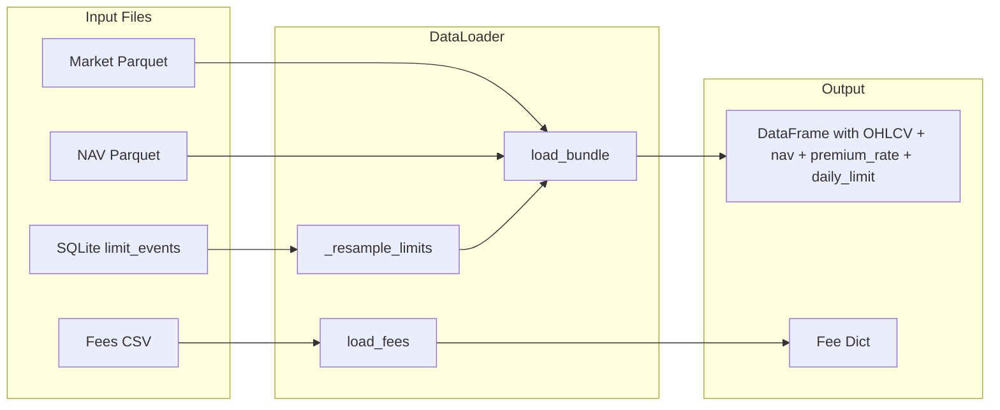

# DataLoader Class Implementation

## Data Format Summary (from inspection)

| Source | Format | Key Columns | Index |

|--------|--------|-------------|-------|

| Market | Parquet | `date`, `ticker`, OHLCV | RangeIndex |

| NAV | Parquet | `date`, `ticker`, `nav` | RangeIndex |

| Limits | SQLite | `ticker`, `start_date`, `end_date`, `max_amount` | - |

| Fees | CSV | `ticker`, tiered fee columns | - |

## Architecture



## Implementation Plan

### File: `data_loader.py` (new file in project root)

**Class: `DataLoader`**

```python
class DataLoader:
    def __init__(self, data_dir: str = './data/mock'):
        ...
    
    def load_bundle(self, ticker: str, start_date: str = None, end_date: str = None) -> pd.DataFrame:
        """
        Returns DataFrame indexed by date with columns:
        open, high, low, close, volume, nav, premium_rate, daily_limit
        """
        ...
    
    def load_fees(self, ticker: str) -> dict:
        """Returns fee config as dict for the ticker."""
        ...
    
    def _resample_limits_to_daily(self, ticker: str, date_index: pd.DatetimeIndex) -> pd.Series:
        """Converts limit_events to daily series."""
        ...
```

### Key Implementation Details

1. **Merge Strategy**: Set `date` as index after loading parquet, then merge market + NAV on index (inner join).

2. **Limit Resampling Logic**:

   - Query SQLite for all limit events matching the ticker
   - For each date in the final DataFrame's index:
     - If date falls within `[start_date, end_date]` of any limit event → `daily_limit = max_amount`
     - Otherwise → `daily_limit = float('inf')`

3. **Data Cleaning**:

   - Apply `ffill()` after merge to handle potential NaN gaps
   - Compute `premium_rate = (close - nav) / nav` after merge

4. **Date Filtering**: Apply `start_date` / `end_date` filter after merge using `.loc[start:end]` slice.

5. **Fee Loading**: Cache [`fees.csv`](data/mock/config/fees.csv) on first call, return dict for requested ticker.

## Output DataFrame Schema

| Column | Type | Description |

|--------|------|-------------|

| (index) | DatetimeIndex | Trading date |

| open | float | Open price |

| high | float | High price |

| low | float | Low price |

| close | float | Close price |

| volume | int | Trading volume |

| nav | float | Net Asset Value |

| premium_rate | float | `(close - nav) / nav` |

| daily_limit | float | Max purchase amount (`inf` if no limit) |