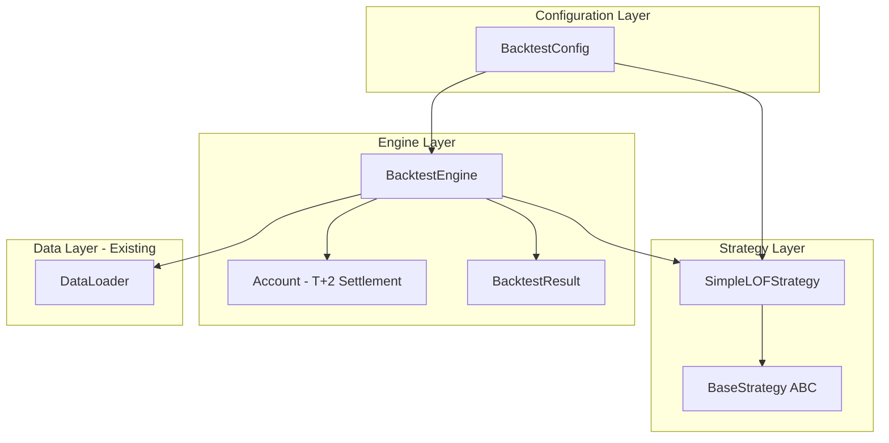
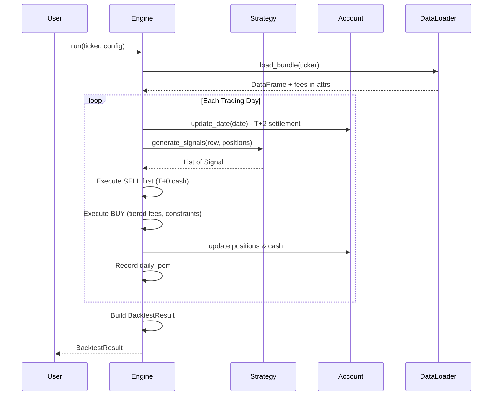

# LOF Backtesting Engine Implementation Plan

## Architecture Overview



## Data Flow



---

## File 1: `src/config.py`

A dataclass holding all backtest parameters.

```python
@dataclass
class BacktestConfig:
    initial_cash: float = 300_000.0
    liquidity_ratio: float = 0.1
    buy_threshold: float = 0.02
    commission_rate: float = 0.0003
    risk_mode: str = 'fixed'  # 'fixed' or 'infinite'
    use_ma5_liquidity: bool = True
    risk_free_rate: float = 0.02
```

---

## File 2: `src/strategy/base.py`

Abstract base class defining the strategy interface.

**Key Design**:

- Define `Signal` dataclass: `(action: str, ticker: str, amount: float)`
- Abstract method `generate_signals(row: pd.Series, positions: Dict, config: BacktestConfig) -> List[Signal]`

---

## File 3: `src/strategy/simple_lof.py`

Concrete implementation of `BaseStrategy`.

**Logic**:

1. **SELL**: If `positions.get(ticker, 0) > 0` -> Signal('sell', ticker, inf)
2. **BUY**: If `premium_rate > config.buy_threshold` AND `daily_limit > 0` -> Signal('buy', ticker, inf)

The `amount=inf` signals "use maximum possible" - the engine resolves this against constraints.

---

## File 4: `src/engine/account.py`

Manages cash, positions, and T+2 settlement queue.

**Key Structures**:

```python
@dataclass
class PendingSettlement:
    settle_date: date
    ticker: str
    shares: float

class Account:
    cash: float
    positions: Dict[str, float]  # ticker -> shares
    pending: List[PendingSettlement]
```

**Methods**:

- `update_date(current_date)`: Settle any pending positions where `settle_date <= current_date`
- `sell(ticker, shares, price, commission)`: Immediate cash credit (T+0)
- `buy(ticker, shares, price, fee)`: Deduct cash, add to pending queue (T+2)
- `get_available_shares(ticker)`: Only settled shares
- `get_total_value(prices: Dict[str, float])`: cash + positions_value

---

## File 5: `src/engine/backtest.py`

### BacktestResult (Dataclass with Cached Properties)

| Attribute/Method | Type | Description |

|------------------|------|-------------|

| `daily_perf` | DataFrame | Index=Date, Cols=[total_assets, cash, positions_value, nav, price] |

| `trade_logs` | DataFrame | Transaction records |

| `config` | BacktestConfig | The config used |

| `total_return` | property | (End / Start) - 1 |

| `annualized_return` | property | Geometric mean annualized (252 days) |

| `max_drawdown` | property | Max peak-to-trough decline |

| `sharpe_ratio` | property | (Ann. Return - Rf) / Ann. Volatility |

| `__str__` | method | Formatted summary |

### Tiered Fee Calculation (Critical)

Read from `df.attrs`:

- `fee_rate_tier_1`, `fee_limit_1`
- `fee_rate_tier_2`, `fee_limit_2`
- `fee_fixed`
```python
def calculate_subscription_fee(amount: float, attrs: dict) -> float:
    if amount < attrs['fee_limit_1']:
        return amount * attrs['fee_rate_tier_1']
    elif amount < attrs['fee_limit_2']:
        return amount * attrs['fee_rate_tier_2']
    else:
        return attrs['fee_fixed']
```


### Execution Flow (Per Day)

1. **Settle**: `account.update_date(date)` - process T+2 queue
2. **Sell First**: Execute all SELL signals. Cash immediately available.
3. **Buy Second**: For each BUY signal:

   - Compute `liquid_cap = min(volume, ma5_volume) * liquidity_ratio` (if `use_ma5_liquidity`)
   - Compute `limit_cap = row['daily_limit']`
   - Compute `cash_cap = account.cash` (if `risk_mode == 'fixed'`)
   - `max_amount = min(liquid_cap, limit_cap, cash_cap)`
   - Calculate fee using tiered logic
   - `shares = (max_amount - fee) / nav`
   - Update account

4. **Record**: Append to `daily_perf` and `trade_logs`

### MA5 Volume Calculation

Pre-compute `ma5_volume = df['volume'].rolling(5).mean()` before the loop.

---

## Edge Case Handling

| Case | Handling |

|------|----------|

| `max_drawdown` on flat curve | Return 0.0 |

| `sharpe_ratio` with zero volatility | Return 0.0 or inf based on return sign |

| `daily_limit = inf` | No subscription limit constraint |

| No trades generated | Return empty `trade_logs`, valid `daily_perf` |

---

## Directory Structure After Implementation

```
src/
  config.py                 # NEW - BacktestConfig
  strategy/
    __init__.py             # NEW
    base.py                 # NEW - BaseStrategy ABC
    simple_lof.py           # NEW - SimpleLOFStrategy
  engine/
    __init__.py             # UPDATE exports
    account.py              # NEW - Account with T+2
    backtest.py             # NEW - BacktestEngine + BacktestResult
```

---

## Key Dependencies

- Existing [`src/data/loader.py`](src/data/loader.py) - `DataLoader.load_bundle()` returns DataFrame with `attrs` containing fee config
- Fee structure from [`data/mock/config/fees.csv`](data/mock/config/fees.csv): `fee_rate_tier_1=0.015`, `fee_limit_1=500000`, etc.