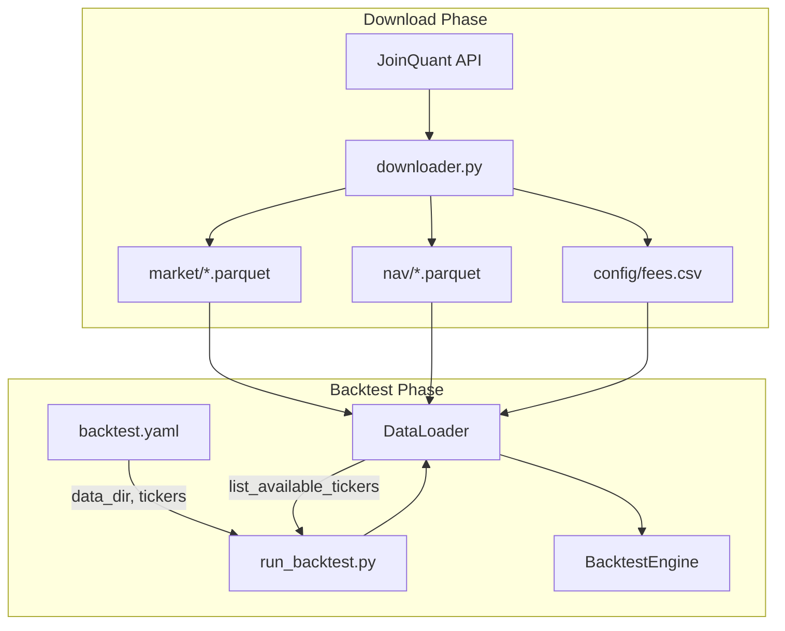

# LOF Real Data Integration Plan

## Goals

- Integrate `eins.py` as a proper module under `src/data/`
- Support auto-discovery of tickers from data directory
- Allow config to specify `tickers: all` instead of explicit lists
- Make data source (mock/real) configurable

---

## Implementation

### 1. Create Downloader Module

Move `eins.py` logic to [`src/data/downloader.py`](src/data/downloader.py):

- Refactor `RealDataDownloader` class with cleaner interface
- Move credentials and constants to config or environment variables
- Keep the same output structure (compatible with `DataLoader`)

### 2. Enhance DataLoader with Ticker Discovery

Add method to [`src/data/loader.py`](src/data/loader.py):

```python
def list_available_tickers(self) -> List[str]:
    """Discover all tickers available in the data directory."""
    market_dir = self.data_dir / 'market'
    return [f.stem for f in market_dir.glob('*.parquet')]
```

### 3. Update Configuration Schema

Modify [`configs/backtest.yaml`](configs/backtest.yaml):

```yaml
# Data source path (relative or absolute)
data_dir: ./data/real_all_lof

# Tickers: explicit list, or "all" to auto-discover
tickers: all
# Or with filters:
# tickers:
#   mode: all
#   exclude: ["502010", "502011"]
```

### 4. Update Run Script

Modify [`run_backtest.py`](run_backtest.py) to:

- Read `data_dir` from config
- Pass `data_dir` to `DataLoader`
- Handle `tickers: all` by calling `loader.list_available_tickers()`

---

## Data Flow Diagram



---

## File Changes Summary

| File | Change |

|------|--------|

| `src/data/downloader.py` | New file - refactored from `eins.py` |

| `src/data/loader.py` | Add `list_available_tickers()` method |

| `src/data/__init__.py` | Export `RealDataDownloader` |

| `configs/backtest.yaml` | Add `data_dir` option, support `tickers: all` |

| `run_backtest.py` | Handle `data_dir` and auto-discovery |

| `eins.py` | Can be deleted or kept as CLI wrapper |