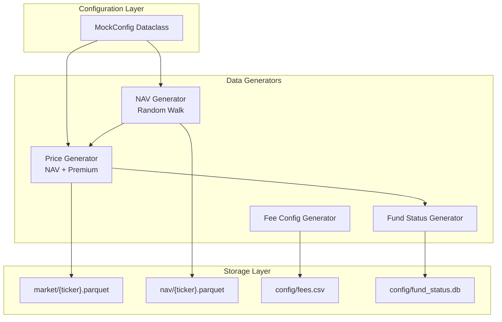
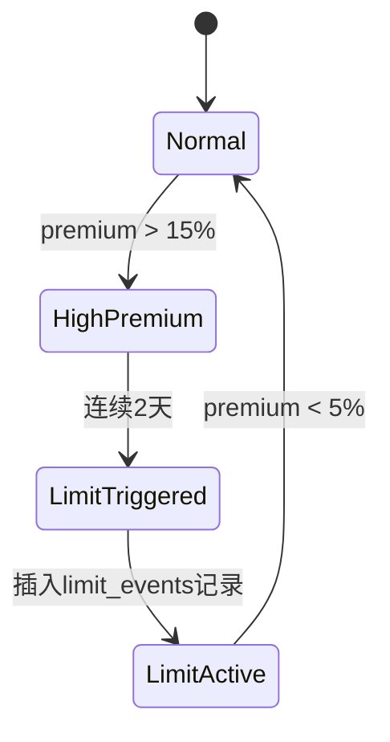

# LOF Mock Data Generator 实现计划

## 架构概览



## 文件结构

```
lof-eins/
├── mock_data_generator/
│   ├── __init__.py
│   ├── config.py          # MockConfig dataclass
│   ├── generators.py      # 核心生成逻辑
│   └── main.py            # 入口脚本
├── data/mock/             # 生成的数据目录
│   ├── market/
│   ├── nav/
│   └── config/
└── requirements.txt
```

## 核心设计

### 1. 配置类 (`config.py`)

```python
@dataclass
class MockConfig:
    tickers: list[str]           # 默认 5 个 Ticker
    start_date: str              # 如 "2024-01-01"
    end_date: str                # 如 "2024-12-31"
    initial_nav: float = 1.0
    premium_volatility: float = 0.05   # 溢价率波动系数
    limit_trigger_threshold: float = 0.15  # 15% 触发限购
    limit_release_threshold: float = 0.05  # 5% 解除限购
    consecutive_days: int = 2    # 连续天数触发
```

### 2. 溢价率飙升机制 (关键)

为确保测试数据包含限购触发场景，采用**混合随机模型**：

- **基础溢价**: 正态分布 N(0, premium_volatility)
- **飙升事件**: 以 3-5% 概率触发"溢价冲击"，使溢价率跳升至 10%-25%
- **均值回归**: 高溢价后逐步回落，模拟市场套利行为
```python
# 伪代码示意
if random() < spike_probability:
    premium = uniform(0.10, 0.25)  # 飙升
else:
    premium = normal(mean_revert_target, volatility)
```


### 3. 限购事件生成逻辑



SQLite 表结构：

```sql
CREATE TABLE limit_events (
    id INTEGER PRIMARY KEY,
    ticker TEXT NOT NULL,
    start_date DATE NOT NULL,
    end_date DATE,
    max_amount REAL DEFAULT 100.0,
    reason TEXT
);
```

### 4. 费率 CSV 结构

| ticker | fee_rate_tier_1 | fee_limit_1 | fee_rate_tier_2 | fee_limit_2 | fee_fixed | redeem_fee_7d |

|--------|-----------------|-------------|-----------------|-------------|-----------|---------------|

| 161005 | 0.015           | 500000      | 0.010           | 2000000     | 1000.0    | 0.015         |

## 实现要点

1. **NAV 生成**: 几何布朗运动 (GBM)，日收益率 ~N(0.0003, 0.015)
2. **OHLC 生成**: 基于 Close 价格反推 Open/High/Low，保持合理价格区间
3. **Volume 生成**: 对数正态分布，与溢价率正相关（高溢价时成交量放大）
4. **数据一致性**: NAV 和 Market 数据日期对齐，跳过周末

## 依赖

```
pandas>=2.0.0
numpy>=1.24.0
pyarrow>=14.0.0
```