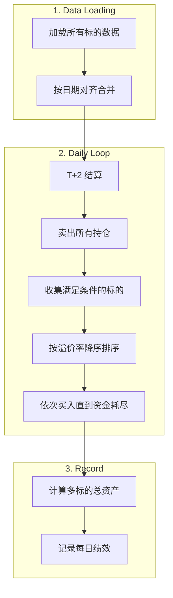

# Multi-Ticker Backtest Engine Extension

## Overview

扩展 `run()` 方法支持多标的回测，实现：

- 统一资金池管理
- 同时持有多只基金
- 按当日溢价率排序，从高到低贪心买入

## Architecture



## Changes

### 1. [src/engine/backtest.py](src/engine/backtest.py)

**修改 `run()` 方法签名：**

```python
def run(
    self,
    tickers: Union[str, List[str]],  # 支持单个或多个 ticker
    start_date: Optional[str] = None,
    end_date: Optional[str] = None
) -> BacktestResult:
```

**核心改动：**

- 数据加载：为每个 ticker 调用 `load_bundle()`，存入 `Dict[str, pd.DataFrame]`
- 日期对齐：取所有标的日期的交集（inner join）
- 每日循环重构：

  1. **Settle**: 调用 `account.update_date()`
  2. **Sell Phase**: 遍历所有持仓标的，执行卖出
  3. **Buy Phase**:

     - 收集当日所有标的的 `(ticker, premium_rate, row, attrs)`
     - 过滤 `premium_rate > threshold` 且 `daily_limit > 0` 的标的
     - 按 `premium_rate` 降序排序
     - 依次调用 `_execute_buy()`，直到资金耗尽
- **Daily Record**: 计算多标的总资产（需传入所有标的的当日价格）

**新增辅助方法：**

```python
def _load_multi_data(
    self,
    tickers: List[str],
    start_date: Optional[str],
    end_date: Optional[str]
) -> Tuple[Dict[str, pd.DataFrame], pd.DatetimeIndex]:
    """Load data for multiple tickers and align dates."""
```

### 2. [src/engine/backtest.py](src/engine/backtest.py) - BacktestResult

**修改 `daily_perf` 结构以支持多标的：**

- 移除单标的的 `nav`, `price` 列
- 保留 `total_assets`, `cash`, `positions_value`
- 可选：新增 `positions_detail` 字典记录各标的持仓

### 3. [src/strategy/base.py](src/strategy/base.py) (可选)

当前策略接口已足够，无需修改。买入排序逻辑在引擎层实现。

## Key Logic: Buy Phase

```python
# 收集当日所有满足条件的买入候选
buy_candidates = []
for ticker, df in all_data.items():
    if current_date not in df.index:
        continue
    row = df.loc[current_date]
    if row['premium_rate'] > config.buy_threshold and row['daily_limit'] > 0:
        buy_candidates.append({
            'ticker': ticker,
            'premium_rate': row['premium_rate'],
            'row': row,
            'attrs': df.attrs
        })

# 按溢价率降序排序
buy_candidates.sort(key=lambda x: x['premium_rate'], reverse=True)

# 贪心买入
for candidate in buy_candidates:
    if account.cash <= 0:
        break
    signal = Signal(action='buy', ticker=candidate['ticker'], amount=float('inf'))
    self._execute_buy(account, signal, candidate['row'], candidate['attrs'], trading_days, current_date)
```

## Edge Cases

| 场景 | 处理方式 |

|------|----------|

| 某标的当日无数据 | 跳过该标的，其他标的正常处理 |

| 所有标的都不满足买入条件 | 仅执行卖出，不买入 |

| 资金不足以买任何标的 | 跳过买入阶段 |

| 单个 ticker 传入 | 自动转换为 `[ticker]`，行为与原来一致 |