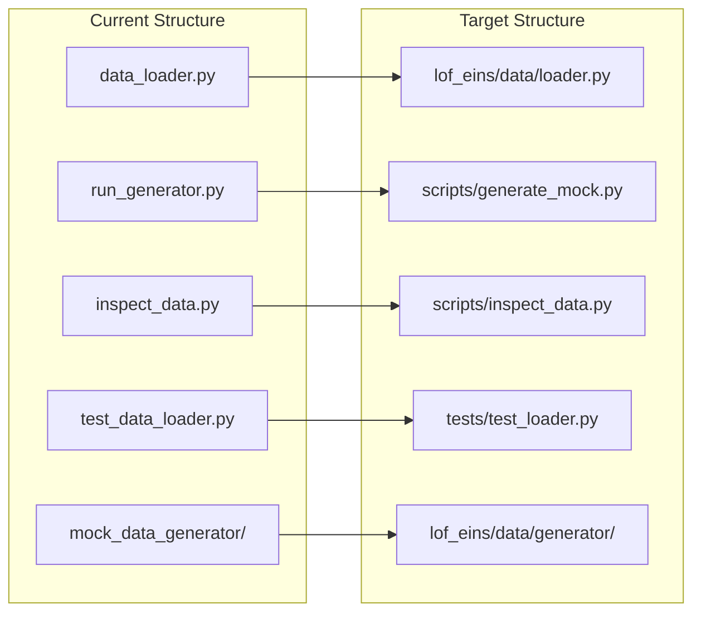

# Package Structure Refactoring Plan

## Current vs Target Structure

## Key Import Changes

| File | Old Import | New Import |

|------|------------|------------|

| `scripts/generate_mock.py` | `from mock_data_generator import ...` | `from lof_eins.data.generator import ...` |

| `tests/test_loader.py` | `from data_loader import DataLoader` | `from lof_eins.data.loader import DataLoader` |

## Implementation Steps

### 1. Create Package Structure

Create directories and `__init__.py` files:

- `lof_eins/__init__.py` - Package root, export version
- `lof_eins/data/__init__.py` - Export `DataLoader` and generator symbols
- `lof_eins/data/generator/__init__.py` - Same exports as old `mock_data_generator/__init__.py`
- `lof_eins/engine/__init__.py` - Empty placeholder for future use
- `scripts/` and `tests/` directories

### 2. Move and Update Source Files

- Move `data_loader.py` to `lof_eins/data/loader.py` (no import changes needed)
- Move `mock_data_generator/*.py` to `lof_eins/data/generator/` (relative imports stay the same)

### 3. Move and Update Script Files

- Move `run_generator.py` to `scripts/generate_mock.py` with updated imports
- Move `inspect_data.py` to `scripts/inspect_data.py` (no import changes, uses direct file paths)

### 4. Move Test Files

- Move `test_data_loader.py` to `tests/test_loader.py` with updated imports

### 5. Cleanup

Delete old files: `data_loader.py`, `run_generator.py`, `inspect_data.py`, `test_data_loader.py`, and entire `mock_data_generator/` directory