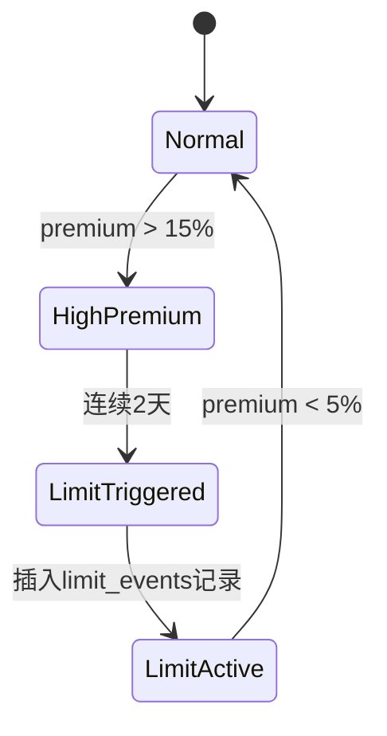

# LOF Fund Arbitrage Backtesting System - Mock Data Generator

## 概述

这是一个配置驱动的 LOF (Listed Open-Ended Fund) 基金套利回测系统的 mock 数据生成器。生成高仿真的测试数据，包括市场行情、NAV、费率配置和基于溢价率动态触发的限购事件。

## 项目结构

```
lof-eins/
├── src/                          # 主源代码包
│   ├── __init__.py
│   ├── data/                     # 数据模块
│   │   ├── __init__.py
│   │   ├── loader.py             # 数据加载器 (DataLoader)
│   │   └── generator/            # Mock 数据生成器
│   │       ├── __init__.py
│   │       ├── config.py         # 配置类 (MockConfig)
│   │       ├── generators.py     # 数据生成器
│   │       └── main.py           # 主入口
│   └── engine/                   # 回测引擎（待实现）
│       └── __init__.py
├── scripts/                      # 可执行脚本
│   ├── generate_mock.py          # 生成 mock 数据
│   └── inspect_data.py           # 数据可视化验证
├── tests/                        # 测试文件
│   └── test_loader.py            # DataLoader 测试
├── data/mock/                    # 生成的数据目录
│   ├── market/                   # 市场数据 (OHLCV)
│   │   └── {ticker}.parquet
│   ├── nav/                      # NAV 数据
│   │   └── {ticker}.parquet
│   └── config/                   # 配置数据
│       ├── fees.csv              # 费率配置
│       └── fund_status.db        # 限购事件 (SQLite)
└── requirements.txt
```

## 依赖安装

```bash
pip install -r requirements.txt
```

依赖项：
- `pandas >= 2.0.0`
- `numpy >= 1.24.0`
- `pyarrow >= 14.0.0`

## 快速开始

### 使用默认配置

```python
from src.data.generator import MockConfig, generate_mock_data

# 使用默认配置生成数据
generate_mock_data()
```

或者直接运行：

```bash
python scripts/generate_mock.py
```

### 自定义配置

```python
from src.data.generator import MockConfig, generate_mock_data

# 自定义配置
config = MockConfig(
    tickers=['161005', '162411', '161725'],
    start_date="2024-01-01",
    end_date="2024-06-30",
    initial_nav=1.0,
    premium_volatility=0.05,
    limit_trigger_threshold=0.15,      # 15% 触发限购
    limit_release_threshold=0.05,      # 5% 解除限购
    consecutive_days=2,                # 连续2天触发
    spike_probability=0.04             # 4% 概率溢价飙升
)

generate_mock_data(config)
```

## 使用 DataLoader 读取数据

生成数据后，使用 `DataLoader` 类读取和对齐所有数据源：

```python
from src.data.loader import DataLoader

# 初始化 DataLoader
loader = DataLoader(data_dir='./data/mock')

# 加载单个 ticker 的完整数据
df = loader.load_bundle('161005')

# 支持日期过滤
df_filtered = loader.load_bundle('161005', start_date='2024-03-01', end_date='2024-06-30')

# 加载费率配置（方式1：直接调用）
fees = loader.load_fees('161005')
print(fees)
# Output: {'fee_rate_tier_1': 0.015, 'fee_limit_1': 500000.0, ...}

# 方式2：从 DataFrame.attrs 获取（load_bundle 自动附加）
df = loader.load_bundle('161005')
print(df.attrs['redeem_fee_7d'])  # 0.015
```

### DataLoader 返回的 DataFrame 结构

| 列名 | 类型 | 说明 |
|------|------|------|
| (index) | DatetimeIndex | 交易日期 |
| open | float | 开盘价 |
| high | float | 最高价 |
| low | float | 最低价 |
| close | float | 收盘价 |
| volume | int | 成交量 |
| nav | float | 净值 |
| premium_rate | float | 溢价率 `(close - nav) / nav` |
| daily_limit | float | 当日申购限额（无限购时为 `inf`） |

### DataLoader 特性

1. **自动对齐多源数据**：基于日期索引自动合并市场数据、NAV 和限购事件
2. **限购事件重采样**：将 SQLite 中的时间段数据重采样为每日序列
3. **预计算溢价率**：自动计算并验证 `premium_rate = (close - nav) / nav`
4. **数据清洗**：使用 `ffill()` 自动处理缺失值
5. **费率缓存**：费率配置在首次加载后缓存，提高性能
6. **费率附加**：费率配置自动附加到 DataFrame.attrs，可通过 `df.attrs['redeem_fee_7d']` 访问

## 配置参数说明

### MockConfig 参数

| 参数 | 类型 | 默认值 | 说明 |
|------|------|--------|------|
| `tickers` | List[str] | `['161005', '162411', ...]` | 基金代码列表 |
| `start_date` | str | `"2024-01-01"` | 开始日期 (YYYY-MM-DD) |
| `end_date` | str | `"2024-12-31"` | 结束日期 (YYYY-MM-DD) |
| `initial_nav` | float | `1.0` | 初始净值 |
| `premium_volatility` | float | `0.05` | 溢价率波动系数 |
| `limit_trigger_threshold` | float | `0.15` | 触发限购的溢价率阈值 (15%) |
| `limit_release_threshold` | float | `0.05` | 解除限购的溢价率阈值 (5%) |
| `consecutive_days` | int | `2` | 触发限购所需的连续天数 |
| `spike_probability` | float | `0.04` | 溢价率飙升事件的概率 (4%) |
| `nav_drift` | float | `0.0003` | NAV 日收益率均值 (~7.5% 年化) |
| `nav_volatility` | float | `0.015` | NAV 日收益率波动率 (~24% 年化) |
| `limit_max_amount` | float | `100.0` | 限购期间最大申购金额 (元) |
| `normal_max_amount` | float | `1_000_000.0` | 正常期间最大申购金额 (元) |

## 数据生成逻辑

### 1. NAV 生成

使用**几何布朗运动 (Geometric Brownian Motion)** 模拟净值走势：

```
dS = μ·S·dt + σ·S·dW
```

- μ: 日收益率均值 (nav_drift)
- σ: 日收益率波动率 (nav_volatility)
- dW: 维纳过程

### 2. 溢价率飙升机制

为确保测试数据包含限购触发场景，采用**混合随机模型**：

- **基础溢价**：正态分布 N(0, premium_volatility)
- **飙升事件**：以 spike_probability 概率触发，溢价率跳升至 10%-25%
- **均值回归**：高溢价后逐步回落，模拟市场套利行为

### 3. 市场数据 (OHLCV)

- **Close**: 基于 NAV + 溢价率计算
- **Open/High/Low**: 基于 Close 反推，保持合理价格区间
- **Volume**: 对数正态分布，与溢价率正相关（高溢价时成交量放大）

### 4. 限购事件触发逻辑



**规则**：
- 当溢价率连续 `consecutive_days` 天超过 `limit_trigger_threshold` 时，触发限购
- 限购从 T+1 日开始
- 限购期间 `max_amount = limit_max_amount` (如 100 元)
- 当溢价率回落到 `limit_release_threshold` 以下时，解除限购

### 5. 费率配置（三档阶梯）

符合中国公募基金通用规则：

| 申购金额 | 费率类型 | 费率 |
|---------|---------|------|
| < 50万 | 比例费率 | 1.5% |
| 50万 - 200万 | 比例费率 | 1.0% |
| ≥ 200万 | 固定费用 | 1000 元/笔 |
| **< 7天赎回** | **惩罚性赎回费** | **1.5%** |

## 数据格式

### Market Data (Parquet)

| 字段 | 类型 | 说明 |
|------|------|------|
| date | datetime | 交易日期 |
| ticker | str | 基金代码 |
| open | float | 开盘价 |
| high | float | 最高价 |
| low | float | 最低价 |
| close | float | 收盘价 |
| volume | int | 成交量 |

### NAV Data (Parquet)

| 字段 | 类型 | 说明 |
|------|------|------|
| date | datetime | 日期 |
| ticker | str | 基金代码 |
| nav | float | 净值 |

### Fee Config (CSV)

| 字段 | 类型 | 说明 |
|------|------|------|
| ticker | str | 基金代码 |
| fee_rate_tier_1 | float | 第一档费率 (1.5%) |
| fee_limit_1 | float | 第一档上限 (50万) |
| fee_rate_tier_2 | float | 第二档费率 (1.0%) |
| fee_limit_2 | float | 第二档上限 (200万) |
| fee_fixed | float | 第三档固定费用 (1000元) |
| redeem_fee_7d | float | 7天内赎回费 (1.5%) |

### Fund Status (SQLite)

**表名**: `limit_events`

| 字段 | 类型 | 说明 |
|------|------|------|
| id | INTEGER | 主键 |
| ticker | TEXT | 基金代码 |
| start_date | DATE | 限购开始日期 |
| end_date | DATE | 限购结束日期 |
| max_amount | REAL | 限购期间最大申购金额 |
| reason | TEXT | 限购原因 |

## 数据验证

运行可视化验证脚本检查生成的数据质量：

```bash
python scripts/inspect_data.py
```

该脚本会创建一个交互式仪表板，包含以下可视化内容：

- **价格 vs 净值对比图**：展示收盘价和净值的走势对比
- **溢价率柱状图**：显示每日溢价率（红色=溢价，绿色=折价），标注 15% 触发阈值线
- **成交量柱状图**：展示每日成交量变化
- **限购区域高亮**：自动识别并高亮显示限购时间段（红色背景区域）

脚本会自动检测 `data/mock/market/` 目录下的所有 ticker，并默认绘制第一个基金的数据。如需查看其他基金，可在脚本中修改 `TICKER` 配置项。

**注意**：运行此脚本需要安装 `plotly` 库：
```bash
pip install plotly
```

## 示例输出

```
======================================================================
LOF Mock Data Generator
======================================================================
Configuration:
  Tickers: ['161005', '162411', '161725', '501018', '160216']
  Date Range: 2024-01-01 to 2024-12-31
  Initial NAV: 1.0
  Limit Trigger Threshold: 15.0%
  Limit Release Threshold: 5.0%
  Consecutive Days: 2
======================================================================

[1/4] Generating fee configuration...
  [OK] Generated: data\mock\config\fees.csv

[2/4] Generating NAV and market data for 5 tickers...
  [1/5] Processing 161005...
      NAV: data\mock\nav\161005.parquet
      Market: data\mock\market\161005.parquet
      Limit Events: 4
  ...

[3/4] Generating fund status database...
  [OK] Generated: data\mock\config\fund_status.db
    Total limit events across all tickers: 23

[4/4] Summary Statistics
======================================================================
  Total Tickers: 5
  Total Limit Events: 23
  Average Limit Events per Ticker: 4.60

  Sample Ticker: 161005
    Trading Days: 262
    NAV Range: 0.6659 - 1.0244
    Price Range: 0.64 - 1.24
    Premium Rate Stats:
      Mean: 3.33%
      Std Dev: 7.31%
      Min: -12.03%
      Max: 23.56%
      Days > 15%: 20
======================================================================
[SUCCESS] Mock data generation completed successfully!
======================================================================
```

## 设计特点

### 1. 配置驱动
- 所有参数通过 `MockConfig` 配置，无硬编码
- 支持灵活的参数调整和场景模拟

### 2. 高仿真度
- NAV 使用几何布朗运动，符合金融资产价格特征
- 溢价率包含飙升机制和均值回归，模拟真实市场行为
- 成交量与溢价率正相关，符合套利交易特征

### 3. 严格的存储边界
- 混合存储架构：Parquet (时序数据) + CSV (配置) + SQLite (事件)
- 数据分离存储，便于独立访问和扩展

### 4. Type Hinting
- 所有函数和类方法都包含完整的类型注解
- 提高代码可读性和 IDE 支持

### 5. 可重现性
- 使用基于 ticker 的随机种子，确保相同配置生成相同数据
- 便于调试和对比测试

## 实现对比

### 溢价率生成策略

#### 方案 1: 纯随机（已采用）
**优点**：
- 实现简单，性能高
- 能保证生成足够的限购触发场景
- 可控性强，适合测试各种边界情况

**缺点**：
- 不完全符合真实市场的时间序列特征

#### 方案 2: ARIMA/GARCH 模型
**优点**：
- 更符合金融时间序列特征
- 自相关性更强

**缺点**：
- 实现复杂度高
- 可能无法保证生成足够的极端场景
- 对于 mock 数据而言过度工程

**结论**：对于测试数据生成，方案 1 更合适。如需更高仿真度，可在后续版本中考虑方案 2。

## 最佳实践

1. **配置管理**：针对不同测试场景创建多个配置文件
2. **数据版本控制**：使用相同的 seed 和配置可重现数据
3. **性能优化**：大规模数据生成时，考虑并行处理多个 ticker
4. **数据清理**：定期清理过期的 mock 数据

## License

MIT
