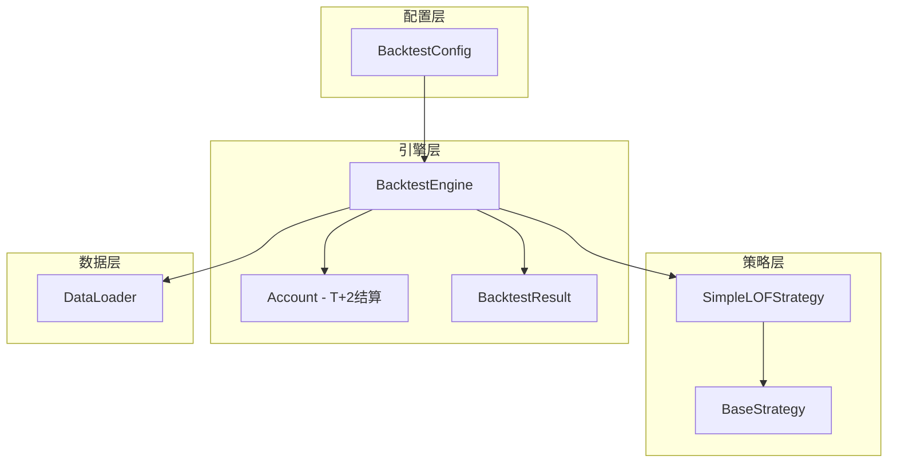
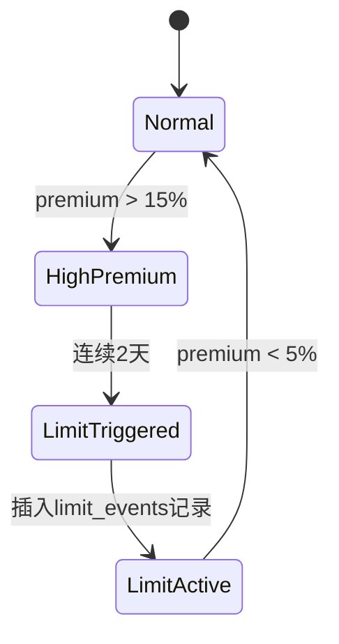

# LOF Fund Arbitrage Backtesting System

## 概述

这是一个配置驱动的 LOF (Listed Open-Ended Fund) 基金套利回测系统。系统包含 mock 数据生成器和完整的回测引擎，支持 T+2 结算、阶梯费率计算和全面的绩效指标分析。

## 项目结构

```
lof-eins/
├── src/                          # 主源代码包
│   ├── __init__.py
│   ├── config.py                 # 回测配置 (BacktestConfig)
│   ├── data/                     # 数据模块
│   │   ├── __init__.py
│   │   ├── loader.py             # 数据加载器 (DataLoader)
│   │   ├── downloader.py         # 真实数据下载器 (RealDataDownloader)
│   │   └── generator/            # Mock 数据生成器
│   │       ├── __init__.py
│   │       ├── config.py         # 配置类 (MockConfig)
│   │       ├── generators.py     # 数据生成器
│   │       └── main.py           # 主入口
│   ├── strategy/                 # 策略模块
│   │   ├── __init__.py
│   │   ├── base.py               # 策略基类 (BaseStrategy, Signal)
│   │   └── simple_lof.py         # 简单 LOF 策略
│   └── engine/                   # 回测引擎
│       ├── __init__.py
│       ├── account.py            # 账户管理 (T+2 结算)
│       └── backtest.py           # 回测执行引擎
├── configs/                      # YAML 配置文件目录
│   ├── backtest.yaml             # 回测配置示例
│   └── mock.yaml                 # Mock 数据生成配置示例
├── scripts/                      # 可执行脚本
│   ├── download_lof.py           # 下载真实 LOF 数据
│   ├── generate_mock.py          # 生成 mock 数据
│   └── inspect_data.py           # 数据可视化验证
├── tests/                        # 测试文件
│   └── test_loader.py            # DataLoader 测试
├── data/                         # 数据目录
│   ├── real_all_lof/             # 真实数据（从 JoinQuant 下载）
│   │   ├── market/               # 市场数据 (OHLCV)
│   │   │   └── {ticker}.parquet
│   │   ├── nav/                  # NAV 数据
│   │   │   └── {ticker}.parquet
│   │   └── config/               # 配置数据
│   │       ├── fees.csv          # 费率配置
│   │       └── fund_status.db    # 限购事件 (SQLite)
│   └── mock/                     # Mock 数据（生成的测试数据）
│       └── (同上结构)
├── .env                          # 环境配置 (JoinQuant 凭证)
└── requirements.txt
```

## 依赖安装

```bash
pip install -r requirements.txt
```

依赖项：
- `pandas >= 2.0.0`
- `numpy >= 1.24.0`
- `pyarrow >= 14.0.0`
- `PyYAML >= 6.0`
- `jqdatasdk >= 1.8.0` (仅用于下载真实数据)
- `python-dotenv >= 0.19.0` (仅用于环境配置)

## 快速开始

### 1. 准备数据

系统支持两种数据源：

#### 选项 A: 下载真实 LOF 数据（推荐）

从 JoinQuant 下载所有 LOF 基金的真实市场数据和净值数据。

**1. 配置 JoinQuant 账户**

创建 `.env` 文件在项目根目录：

```bash
JQ_USERNAME=your_username
JQ_PASSWORD=your_password
```

**2. 运行下载脚本**

```bash
# 使用默认配置（最近2个月数据）
python scripts/download_lof.py

# 自定义日期范围
python scripts/download_lof.py --start 2024-01-01 --end 2024-12-31

# 自定义输出目录
python scripts/download_lof.py --output ./data/custom

# 调整批量大小（避免超时）
python scripts/download_lof.py --batch-size 30
```

**特性**：
- 自动发现所有 LOF 基金（通常有 400+ 个）
- 智能分批下载，避免 API 超时
- 自动处理限购事件（基于公告）
- 下载真实费率配置
- 数据输出结构与 `DataLoader` 完全兼容

**输出目录结构**：
```
data/real_all_lof/
├── market/          # 市场数据 (OHLCV)
│   ├── 160216.parquet
│   ├── 161005.parquet
│   └── ...
├── nav/             # 净值数据
│   ├── 160216.parquet
│   ├── 161005.parquet
│   └── ...
└── config/
    ├── fees.csv         # 费率配置
    └── fund_status.db   # 限购事件 (SQLite)
```

#### 选项 B: 生成 Mock 数据（用于测试）

#### 方式 1: 使用 YAML 配置文件（推荐）

编辑 `configs/mock.yaml` 文件自定义参数，然后运行：

```bash
# 使用默认配置文件 (configs/mock.yaml)
python scripts/generate_mock.py

# 使用自定义配置文件
python scripts/generate_mock.py --config configs/my_mock.yaml
```

#### 方式 2: 使用 Python 代码配置

```python
from src.data.generator import MockConfig, generate_mock_data

# 从 YAML 文件加载配置
config = MockConfig.from_yaml("configs/mock.yaml")

# 或者直接在代码中配置
config = MockConfig(
    tickers=['161005', '162411', '161725'],
    start_date="2024-01-01",
    end_date="2024-06-30",
    initial_nav=1.0,
    premium_volatility=0.05,
    limit_trigger_threshold=0.15,      # 15% 触发限购
    limit_release_threshold=0.05,      # 5% 解除限购
    consecutive_days=2,                # 连续2天触发
    spike_probability=0.04             # 4% 概率溢价飙升
)

# 生成数据
generate_mock_data(config)

# 可选：将配置保存到文件
config.to_yaml("configs/my_saved_config.yaml")
```

### 2. 运行回测

#### 方式 1: 使用 YAML 配置文件（推荐）

编辑 `configs/backtest.yaml` 文件自定义参数：

```yaml
# 数据源目录
data_dir: ./data/real_all_lof  # 真实数据
# data_dir: ./data/mock         # Mock 数据

# 回测标的（支持三种模式）
tickers: all  # 自动发现所有可用的 ticker
# tickers:    # 或指定具体列表
#   - "161005"
#   - "162411"

# 其他配置参数...
initial_cash: 300000.0
buy_threshold: 0.02
```

然后运行：

```bash
# 使用默认配置文件 (configs/backtest.yaml)
python run_backtest.py

# 使用自定义配置文件
python run_backtest.py --config configs/my_backtest.yaml
```

**新特性 - 自动 Ticker 发现**：
- 设置 `tickers: all` 会自动扫描 `data_dir/market/` 目录
- 无需手动维护 ticker 列表
- 适合处理大量 LOF 基金（如 400+ 个真实数据）

#### 方式 2: 使用 Python 代码配置

```python
import logging
from src import BacktestConfig, BacktestEngine, SimpleLOFStrategy, DataLoader

# 配置日志
logging.basicConfig(level=logging.INFO)

# 从 YAML 文件加载配置
config = BacktestConfig.from_yaml("configs/backtest.yaml")

# 或者直接在代码中配置
config = BacktestConfig(
    initial_cash=300_000.0,     # 初始资金
    buy_threshold=0.02,         # 2% 溢价率触发买入
    liquidity_ratio=0.1,        # 使用 10% 的可用流动性
    commission_rate=0.0003,     # 0.03% 卖出佣金
    risk_mode='fixed',          # 固定资金模式
    use_ma5_liquidity=True,     # 使用 MA5 成交量
    risk_free_rate=0.02         # 2% 无风险利率
)

# 初始化回测引擎
strategy = SimpleLOFStrategy()
loader = DataLoader(data_dir='./data/mock')
engine = BacktestEngine(config=config, strategy=strategy, data_loader=loader)

# 运行回测（可指定 tickers）
result = engine.run(tickers=['161005', '162411', '161725', '501018', '160216'])

# 打印结果
print(result)
print(f"\n交易记录:\n{result.trade_logs.head()}")
print(f"\n每日绩效:\n{result.daily_perf.head()}")
```

#### 输出示例

```
============================================================
BACKTEST RESULTS
============================================================

Performance Metrics:
  Total Return:         125.91%
  Annualized Return:    118.99%
  Max Drawdown:          17.06%
  Sharpe Ratio:            2.11

Trading Summary:
  Total Trades:             283
  Buy Trades:               142
  Sell Trades:              141

Account Summary:
  Initial Capital:       312,546.70 CNY
  Final Value:           706,068.16 CNY
  Profit/Loss:           393,521.46 CNY

Configuration:
  Buy Threshold:          2.00%
  Liquidity Ratio:       10.00%
  Risk Mode:              fixed
============================================================
```

## 回测引擎架构

### 核心组件



### BacktestConfig 参数

| 参数 | 类型 | 默认值 | 说明 |
|------|------|--------|------|
| `initial_cash` | float | `300_000.0` | 初始资金 |
| `liquidity_ratio` | float | `0.1` | 流动性比例（占可用成交量的比例） |
| `buy_threshold` | float | `0.02` | 买入阈值（最低溢价率） |
| `commission_rate` | float | `0.0003` | 卖出佣金率 |
| `risk_mode` | str | `'fixed'` | 风险模式（'fixed' 或 'infinite'） |
| `use_ma5_liquidity` | bool | `True` | 是否使用 MA5 成交量限制 |
| `risk_free_rate` | float | `0.02` | 无风险利率（用于夏普比率） |

### SimpleLOFStrategy 逻辑

1. **卖出**：如果持有任何仓位 -> 全部卖出（快速止盈）
2. **买入**：如果 `溢价率 > buy_threshold` 且 `daily_limit > 0` -> 买入最大可能金额

### T+2 结算机制

- **买入**：资金立即扣除，份额进入待结算队列（T+2 交易日后到账）
- **卖出**：资金 T+0 到账（立即可用），仅能卖出已结算份额
- **结算日期**：基于实际交易日历计算（非自然日）

### 费率计算（阶梯式）

| 申购金额 | 费率类型 | 费率 |
|---------|---------|------|
| < 50万 | 比例费率 | 1.5% |
| 50万 - 200万 | 比例费率 | 1.0% |
| ≥ 200万 | 固定费用 | 1000 元/笔 |

**卖出佣金**：按 `commission_rate` 比例收取（默认 0.03%）

### 约束条件（买入时取最小值）

1. **限购约束**：`row['daily_limit']`（来自 SQLite 限购事件）
2. **流动性约束**：`min(volume, ma5_volume) * liquidity_ratio * price`
3. **资金约束**：`account.cash`（仅在 `risk_mode='fixed'` 时）

### BacktestResult 指标

| 指标 | 计算公式 | 说明 |
|------|---------|------|
| `total_return` | `(End / Start) - 1` | 总收益率 |
| `annualized_return` | `(1 + R)^(252/n) - 1` | 年化收益率（假设 252 个交易日） |
| `max_drawdown` | `max((Peak - Trough) / Peak)` | 最大回撤 |
| `sharpe_ratio` | `(R - Rf) / σ` | 夏普比率（年化） |

## 使用 DataLoader 读取数据

生成数据后，使用 `DataLoader` 类读取和对齐所有数据源：

```python
from src.data.loader import DataLoader

# 初始化 DataLoader
loader = DataLoader(data_dir='./data/mock')

# 加载单个 ticker 的完整数据
df = loader.load_bundle('161005')

# 支持日期过滤
df_filtered = loader.load_bundle('161005', start_date='2024-03-01', end_date='2024-06-30')

# 加载费率配置（方式1：直接调用）
fees = loader.load_fees('161005')
print(fees)
# Output: {'fee_rate_tier_1': 0.015, 'fee_limit_1': 500000.0, ...}

# 方式2：从 DataFrame.attrs 获取（load_bundle 自动附加）
df = loader.load_bundle('161005')
print(df.attrs['redeem_fee_7d'])  # 0.015
```

### DataLoader 返回的 DataFrame 结构

| 列名 | 类型 | 说明 |
|------|------|------|
| (index) | DatetimeIndex | 交易日期 |
| open | float | 开盘价 |
| high | float | 最高价 |
| low | float | 最低价 |
| close | float | 收盘价 |
| volume | int | 成交量 |
| nav | float | 净值 |
| premium_rate | float | 溢价率 `(close - nav) / nav` |
| daily_limit | float | 当日申购限额（无限购时为 `inf`） |

### DataLoader 特性

1. **自动对齐多源数据**：基于日期索引自动合并市场数据、NAV 和限购事件
2. **限购事件重采样**：将 SQLite 中的时间段数据重采样为每日序列
3. **预计算溢价率**：自动计算并验证 `premium_rate = (close - nav) / nav`
4. **数据清洗**：使用 `ffill()` 自动处理缺失值
5. **费率缓存**：费率配置在首次加载后缓存，提高性能
6. **费率附加**：费率配置自动附加到 DataFrame.attrs，可通过 `df.attrs['redeem_fee_7d']` 访问
7. **自动 Ticker 发现**：`list_available_tickers()` 方法扫描数据目录，自动发现所有可用基金

## 配置文件管理

系统支持 YAML 格式的外部配置文件，方便进行参数调整和测试场景管理。

### 配置文件位置

- **回测配置**: `configs/backtest.yaml`
- **Mock 数据生成配置**: `configs/mock.yaml`

### 配置文件示例

**configs/backtest.yaml**:
```yaml
initial_cash: 300000.0
buy_threshold: 0.02
liquidity_ratio: 0.1
commission_rate: 0.0003
risk_mode: fixed
use_ma5_liquidity: true
risk_free_rate: 0.02

# 回测标的（非 BacktestConfig 字段）
tickers:
  - "161005"
  - "162411"
  - "161725"
```

**configs/mock.yaml**:
```yaml
tickers:
  - "161005"
  - "162411"
start_date: "2024-01-01"
end_date: "2024-12-31"
initial_nav: 2.0
premium_volatility: 0.01
limit_trigger_threshold: 0.07
limit_release_threshold: 0.03
consecutive_days: 1
```

### 配置文件 API

两个配置类都支持从 YAML 加载和保存：

```python
from src import BacktestConfig
from src.data.generator import MockConfig

# 加载配置
backtest_config = BacktestConfig.from_yaml("configs/backtest.yaml")
mock_config = MockConfig.from_yaml("configs/mock.yaml")

# 保存配置
backtest_config.to_yaml("configs/my_backtest.yaml")
mock_config.to_yaml("configs/my_mock.yaml")
```

### 数据源配置

在 `backtest.yaml` 中指定数据源：

```yaml
# 使用真实数据
data_dir: ./data/real_all_lof
tickers: all  # 自动发现所有可用基金

# 或使用 Mock 数据
data_dir: ./data/mock
tickers:
  - "161005"
  - "162411"
```

`run_backtest.py` 会自动根据 `data_dir` 创建对应的 `DataLoader` 实例，并处理 `tickers: all` 的情况。

### 多场景测试建议

针对不同测试场景创建多个配置文件：

```
configs/
├── backtest.yaml              # 默认配置
├── backtest_aggressive.yaml   # 激进策略
├── backtest_conservative.yaml # 保守策略
├── mock.yaml                  # 默认数据生成
├── mock_high_volatility.yaml  # 高波动场景
└── mock_frequent_limits.yaml  # 频繁限购场景
```

然后使用 `--config` 参数运行不同场景：

```bash
python run_backtest.py --config configs/backtest_aggressive.yaml
python scripts/generate_mock.py --config configs/mock_high_volatility.yaml
```

## 配置参数说明

### MockConfig 参数

| 参数 | 类型 | 默认值 | 说明 |
|------|------|--------|------|
| `tickers` | List[str] | `['161005', '162411', ...]` | 基金代码列表 |
| `start_date` | str | `"2024-01-01"` | 开始日期 (YYYY-MM-DD) |
| `end_date` | str | `"2024-12-31"` | 结束日期 (YYYY-MM-DD) |
| `initial_nav` | float | `1.0` | 初始净值 |
| `premium_volatility` | float | `0.05` | 溢价率波动系数 |
| `limit_trigger_threshold` | float | `0.15` | 触发限购的溢价率阈值 (15%) |
| `limit_release_threshold` | float | `0.05` | 解除限购的溢价率阈值 (5%) |
| `consecutive_days` | int | `2` | 触发限购所需的连续天数 |
| `spike_probability` | float | `0.04` | 溢价率飙升事件的概率 (4%) |
| `nav_drift` | float | `0.0003` | NAV 日收益率均值 (~7.5% 年化) |
| `nav_volatility` | float | `0.015` | NAV 日收益率波动率 (~24% 年化) |
| `limit_max_amount` | float | `100.0` | 限购期间最大申购金额 (元) |
| `normal_max_amount` | float | `1_000_000.0` | 正常期间最大申购金额 (元) |

## 数据生成逻辑

### 1. NAV 生成

使用**几何布朗运动 (Geometric Brownian Motion)** 模拟净值走势：

```
dS = μ·S·dt + σ·S·dW
```

- μ: 日收益率均值 (nav_drift)
- σ: 日收益率波动率 (nav_volatility)
- dW: 维纳过程

### 2. 溢价率飙升机制

为确保测试数据包含限购触发场景，采用**混合随机模型**：

- **基础溢价**：正态分布 N(0, premium_volatility)
- **飙升事件**：以 spike_probability 概率触发，溢价率跳升至 10%-25%
- **均值回归**：高溢价后逐步回落，模拟市场套利行为

### 3. 市场数据 (OHLCV)

- **Close**: 基于 NAV + 溢价率计算
- **Open/High/Low**: 基于 Close 反推，保持合理价格区间
- **Volume**: 对数正态分布，与溢价率正相关（高溢价时成交量放大）

### 4. 限购事件触发逻辑



**规则**：
- 当溢价率连续 `consecutive_days` 天超过 `limit_trigger_threshold` 时，触发限购
- 限购从 T+1 日开始
- 限购期间 `max_amount = limit_max_amount` (如 100 元)
- 当溢价率回落到 `limit_release_threshold` 以下时，解除限购

### 5. 费率配置（三档阶梯）

符合中国公募基金通用规则：

| 申购金额 | 费率类型 | 费率 |
|---------|---------|------|
| < 50万 | 比例费率 | 1.5% |
| 50万 - 200万 | 比例费率 | 1.0% |
| ≥ 200万 | 固定费用 | 1000 元/笔 |
| **< 7天赎回** | **惩罚性赎回费** | **1.5%** |

## 数据格式

### Market Data (Parquet)

| 字段 | 类型 | 说明 |
|------|------|------|
| date | datetime | 交易日期 |
| ticker | str | 基金代码 |
| open | float | 开盘价 |
| high | float | 最高价 |
| low | float | 最低价 |
| close | float | 收盘价 |
| volume | int | 成交量 |

### NAV Data (Parquet)

| 字段 | 类型 | 说明 |
|------|------|------|
| date | datetime | 日期 |
| ticker | str | 基金代码 |
| nav | float | 净值 |

### Fee Config (CSV)

| 字段 | 类型 | 说明 |
|------|------|------|
| ticker | str | 基金代码 |
| fee_rate_tier_1 | float | 第一档费率 (1.5%) |
| fee_limit_1 | float | 第一档上限 (50万) |
| fee_rate_tier_2 | float | 第二档费率 (1.0%) |
| fee_limit_2 | float | 第二档上限 (200万) |
| fee_fixed | float | 第三档固定费用 (1000元) |
| redeem_fee_7d | float | 7天内赎回费 (1.5%) |

### Fund Status (SQLite)

**表名**: `limit_events`

| 字段 | 类型 | 说明 |
|------|------|------|
| id | INTEGER | 主键 |
| ticker | TEXT | 基金代码 |
| start_date | DATE | 限购开始日期 |
| end_date | DATE | 限购结束日期 |
| max_amount | REAL | 限购期间最大申购金额 |
| reason | TEXT | 限购原因 |

## 真实数据下载器 (RealDataDownloader)

### 功能特性

`RealDataDownloader` 类提供了从 JoinQuant 下载真实 LOF 基金数据的能力：

1. **自动发现所有 LOF 基金**：通过 JoinQuant API 查询所有上市 LOF 基金代码
2. **批量下载**：智能分批处理，避免 API 超时和限流
3. **完整数据下载**：
   - 市场数据（OHLCV）：从 `get_price()` API 获取
   - 净值数据（NAV）：从 `finance.run_query()` API 获取
   - 限购事件：从基金公告中解析限购信息
   - 费率配置：生成标准费率 CSV 文件
4. **数据格式兼容**：输出格式与 `DataLoader` 完全兼容，可直接用于回测

### 使用示例

```python
from src.data.downloader import RealDataDownloader
import os

# 方式 1: 从环境变量读取凭证
downloader = RealDataDownloader(output_dir='./data/real_all_lof')
downloader.authenticate_from_env()

# 方式 2: 直接传入凭证
downloader = RealDataDownloader()
downloader.authenticate(username='your_username', password='your_password')

# 下载所有 LOF 基金数据
downloader.download_all(
    start_date='2024-01-01',
    end_date='2024-12-31'
)

# 或下载指定基金列表
downloader.download_tickers(
    tickers=['161005', '162411', '161725'],
    start_date='2024-01-01',
    end_date='2024-12-31'
)
```

### 命令行使用

```bash
# 使用默认配置（从 .env 读取凭证）
python scripts/download_lof.py

# 自定义参数
python scripts/download_lof.py \
    --start 2024-01-01 \
    --end 2024-12-31 \
    --output ./data/custom \
    --batch-size 30
```

### 注意事项

- **API 配额**：JoinQuant 免费账户有每日查询次数限制，建议分批下载或使用付费账户
- **数据完整性**：某些基金可能缺少历史数据，下载器会自动跳过并记录警告
- **限购事件解析**：限购信息从基金公告中提取，可能不完整，建议手动验证重要基金
- **网络稳定性**：大规模下载时建议在网络稳定的环境下运行，支持断点续传（跳过已存在的文件）

## 数据验证

运行可视化验证脚本检查生成的数据质量：

```bash
python scripts/inspect_data.py
```

该脚本会创建一个交互式仪表板，包含以下可视化内容：

- **价格 vs 净值对比图**：展示收盘价和净值的走势对比
- **溢价率柱状图**：显示每日溢价率（红色=溢价，绿色=折价），标注 15% 触发阈值线
- **成交量柱状图**：展示每日成交量变化
- **限购区域高亮**：自动识别并高亮显示限购时间段（红色背景区域）

脚本会自动检测 `data/mock/market/` 目录下的所有 ticker，并默认绘制第一个基金的数据。如需查看其他基金，可在脚本中修改 `TICKER` 配置项。

**注意**：运行此脚本需要安装 `plotly` 库：
```bash
pip install plotly
```

## 示例输出

```
======================================================================
LOF Mock Data Generator
======================================================================
Configuration:
  Tickers: ['161005', '162411', '161725', '501018', '160216']
  Date Range: 2024-01-01 to 2024-12-31
  Initial NAV: 1.0
  Limit Trigger Threshold: 15.0%
  Limit Release Threshold: 5.0%
  Consecutive Days: 2
======================================================================

[1/4] Generating fee configuration...
  [OK] Generated: data\mock\config\fees.csv

[2/4] Generating NAV and market data for 5 tickers...
  [1/5] Processing 161005...
      NAV: data\mock\nav\161005.parquet
      Market: data\mock\market\161005.parquet
      Limit Events: 4
  ...

[3/4] Generating fund status database...
  [OK] Generated: data\mock\config\fund_status.db
    Total limit events across all tickers: 23

[4/4] Summary Statistics
======================================================================
  Total Tickers: 5
  Total Limit Events: 23
  Average Limit Events per Ticker: 4.60

  Sample Ticker: 161005
    Trading Days: 262
    NAV Range: 0.6659 - 1.0244
    Price Range: 0.64 - 1.24
    Premium Rate Stats:
      Mean: 3.33%
      Std Dev: 7.31%
      Min: -12.03%
      Max: 23.56%
      Days > 15%: 20
======================================================================
[SUCCESS] Mock data generation completed successfully!
======================================================================
```

## 设计特点

### 1. 配置驱动
- 所有参数通过 YAML 配置文件管理，支持外部化配置
- 配置类（`MockConfig`、`BacktestConfig`）支持 `from_yaml()` 和 `to_yaml()` 方法
- 支持灵活的参数调整和多场景测试

### 2. 高仿真度
- NAV 使用几何布朗运动，符合金融资产价格特征
- 溢价率包含飙升机制和均值回归，模拟真实市场行为
- 成交量与溢价率正相关，符合套利交易特征

### 3. 严格的存储边界
- 混合存储架构：Parquet (时序数据) + CSV (配置) + SQLite (事件)
- 数据分离存储，便于独立访问和扩展

### 4. Type Hinting
- 所有函数和类方法都包含完整的类型注解
- 提高代码可读性和 IDE 支持

### 5. 可重现性
- 使用基于 ticker 的随机种子，确保相同配置生成相同数据
- 便于调试和对比测试

## 实现对比

### 溢价率生成策略

#### 方案 1: 纯随机（已采用）
**优点**：
- 实现简单，性能高
- 能保证生成足够的限购触发场景
- 可控性强，适合测试各种边界情况

**缺点**：
- 不完全符合真实市场的时间序列特征

#### 方案 2: ARIMA/GARCH 模型
**优点**：
- 更符合金融时间序列特征
- 自相关性更强

**缺点**：
- 实现复杂度高
- 可能无法保证生成足够的极端场景
- 对于 mock 数据而言过度工程

**结论**：对于测试数据生成，方案 1 更合适。如需更高仿真度，可在后续版本中考虑方案 2。

## 自定义策略

通过继承 `BaseStrategy` 实现自定义策略：

```python
from src.strategy.base import BaseStrategy, Signal
from typing import Dict, List
import pandas as pd

class MyStrategy(BaseStrategy):
    def generate_signals(
        self,
        row: pd.Series,
        positions: Dict[str, float],
        config: BacktestConfig
    ) -> List[Signal]:
        signals = []
        ticker = row['ticker']
        
        # 自定义逻辑
        if row['premium_rate'] > 0.05:  # 5% 溢价时买入
            signals.append(Signal('buy', ticker, 100_000.0))
        
        if row['premium_rate'] < 0.01:  # 1% 溢价时卖出
            if positions.get(ticker, 0) > 0:
                signals.append(Signal('sell', ticker, float('inf')))
        
        return signals
```

## API 参考

### BacktestEngine

```python
engine = BacktestEngine(
    config: BacktestConfig,
    strategy: BaseStrategy,
    data_loader: Optional[DataLoader] = None
)

result = engine.run(
    ticker: str,
    start_date: Optional[str] = None,  # 'YYYY-MM-DD'
    end_date: Optional[str] = None     # 'YYYY-MM-DD'
) -> BacktestResult
```

### BacktestResult

```python
result.daily_perf          # DataFrame: 每日绩效数据
result.trade_logs          # DataFrame: 交易日志
result.config              # BacktestConfig: 回测配置
result.total_return        # float: 总收益率
result.annualized_return   # float: 年化收益率
result.max_drawdown        # float: 最大回撤
result.sharpe_ratio        # float: 夏普比率
result.num_trades          # int: 总交易次数
result.num_buy_trades      # int: 买入次数
result.num_sell_trades     # int: 卖出次数
```

## 最佳实践

### 配置管理

1. **使用 YAML 配置文件**：推荐使用 YAML 文件而非硬编码配置，便于版本控制和参数对比
2. **场景化配置**：为不同测试场景创建专门的配置文件（如 `backtest_aggressive.yaml`、`mock_high_volatility.yaml`）
3. **配置版本化**：将配置文件纳入 Git 版本控制，记录参数变更历史
4. **配置文档化**：在 YAML 文件中添加注释说明参数含义和调整原因

### 数据生成

1. **配置复用**：使用 `to_yaml()` 保存成功的配置供后续复用
2. **数据版本控制**：使用相同的 seed 和配置可重现数据
3. **性能优化**：大规模数据生成时，考虑并行处理多个 ticker
4. **数据清理**：定期清理过期的 mock 数据

### 回测优化

1. **参数调优**：创建多个配置文件进行网格搜索，调整 `buy_threshold`、`liquidity_ratio` 等参数
2. **批量测试**：使用脚本循环调用不同配置文件，自动化测试流程
3. **多标的对比**：在配置文件中指定不同的 tickers 列表，对比策略表现
4. **日志分析**：设置 `logging.DEBUG` 级别查看详细的交易执行信息
5. **结果可视化**：使用 `result.daily_perf` 绘制收益曲线和回撤图

## License

MIT
