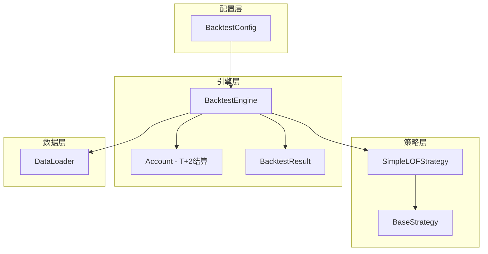

# LOF 基金套利回测系统

## 概述

这是一个配置驱动的 LOF (Listed Open-Ended Fund) 基金套利回测系统，具备**限购增强功能**：从基金公告 PDF 中自动提取限购信息，生成准确的每日限购数据用于回测。

系统包含完整的回测引擎（T+2 结算、阶梯费率）、mock 数据生成器，以及公告处理流水线（PDF 文本提取 → LLM 解析 → 数据库存储）。

**核心价值：** 准确的限购数据是可靠套利回测的前提。系统通过本地 LLM 解析基金公告，自动识别限购事件并集成到回测数据中。

**项目进度：** Phase 1（基础架构）✅ Phase 2（PDF 处理）✅ Phase 3（时间线集成）🔲 Phase 4（端到端集成）🔲

## 项目结构

```
lof-eins/
├── src/                               # 主源代码包
│   ├── __init__.py
│   ├── config.py                      # 回测配置 (BacktestConfig)
│   ├── data/                          # 数据模块
│   │   ├── __init__.py
│   │   ├── loader.py                  # 数据加载器 (支持 NULL end_date)
│   │   ├── downloader.py              # 真实数据下载器 (JoinQuant)
│   │   ├── announcement_downloader.py # 公告 PDF 下载器 (Eastmoney)
│   │   ├── pdf_extractor.py           # PDF 文本提取 (pdfplumber)
│   │   ├── llm_client.py             # LLM 解析客户端 (Ollama)
│   │   ├── announcement_processor.py  # 公告处理流水线
│   │   └── generator/                 # Mock 数据生成器
│   │       ├── __init__.py
│   │       ├── config.py
│   │       ├── generators.py
│   │       └── main.py
│   ├── strategy/                      # 策略模块
│   │   ├── __init__.py
│   │   ├── base.py                    # 策略基类 (BaseStrategy, Signal)
│   │   └── simple_lof.py             # 简单 LOF 策略
│   └── engine/                        # 回测引擎
│       ├── __init__.py
│       ├── account.py                 # 账户管理 (T+2 结算)
│       └── backtest.py                # 回测执行引擎
├── scripts/                           # 可执行脚本
│   ├── download_lof.py                # 下载市场/NAV 数据 (JoinQuant)
│   ├── download_announcements.py      # 下载公告 PDF (Eastmoney)
│   ├── parse_announcements.py         # 解析公告 PDF → 限购数据 (Ollama)
│   ├── generate_mock.py               # 生成 mock 数据
│   └── inspect_data.py                # 数据可视化验证
├── tests/                             # 测试文件 (103+ 测试用例)
│   ├── test_loader.py                 # DataLoader 测试
│   ├── test_open_ended_limits.py      # 开放式限购测试 (12 tests)
│   ├── test_database_schema.py        # 数据库 schema 测试 (47 tests)
│   ├── test_pdf_extractor.py          # PDF 提取测试 (9 tests)
│   ├── test_llm_client.py            # LLM 客户端测试 (22 tests)
│   └── test_announcement_processor.py # 流水线测试 (13 tests)
├── configs/                           # YAML 配置文件
│   ├── backtest.yaml                  # 回测配置
│   └── mock.yaml                      # Mock 数据生成配置
├── data/                              # 数据目录 (gitignored)
├── requirements.txt
├── run_backtest.py                    # 回测入口
└── TECHNICAL_PROPOSAL.md              # 技术方案文档
```

## 依赖安装

```bash
pip install -r requirements.txt
```

依赖项：
- `numpy >= 1.26.4` — 数值计算
- `pyarrow >= 14.0.0` — Parquet 文件读写
- `PyYAML >= 6.0` — YAML 配置解析
- `jqdatasdk >= 1.9.8` — JoinQuant 数据下载
- `python-dotenv >= 1.0.0` — 环境配置
- `pdfplumber >= 0.10.0` — PDF 文本提取（中文支持）
- `requests >= 2.32.3` — HTTP 客户端
- `ollama >= 0.4.0` — Ollama LLM API 客户端
- `plotly >= 5.0.0` — 数据可视化（可选）

### Ollama 安装

公告解析功能需要本地运行 Ollama：

1. 从 https://ollama.com 下载安装 Ollama
2. 拉取推荐模型：
   ```bash
   ollama pull qwen3:8b
   ```
3. 确认 Ollama 正在运行（默认端口 `localhost:11434`）

可通过环境变量自定义：
- `OLLAMA_HOST` — Ollama API 地址（默认 `http://localhost:11434`）
- `OLLAMA_MODEL` — 使用的模型（默认 `qwen3:8b`）

## 快速开始

### 1. 准备数据

#### 选项 A: 下载真实 LOF 数据（推荐）

**1. 配置 JoinQuant 账户**

创建 `.env` 文件在项目根目录：

```bash
JQ_USERNAME=your_username
JQ_PASSWORD=your_password
```

**2. 下载市场/NAV 数据**

```bash
# 使用默认配置（最近2个月）
python scripts/download_lof.py

# 自定义日期范围
python scripts/download_lof.py --start 2024-01-01 --end 2024-12-31
```

**3. 下载基金公告 PDF**

```bash
# 下载所有 ticker 的公告
python scripts/download_announcements.py

# 下载指定 ticker
python scripts/download_announcements.py --ticker 161005
```

**4. 解析公告提取限购信息**

```bash
# 解析单个 ticker 的公告（需要 Ollama 运行中）
python scripts/parse_announcements.py --ticker 161005

# 解析所有 ticker
python scripts/parse_announcements.py --all

# 调试模式
python scripts/parse_announcements.py --ticker 161005 --verbose
```

#### 选项 B: 生成 Mock 数据（用于测试）

```bash
# 使用默认配置
python scripts/generate_mock.py

# 使用自定义配置
python scripts/generate_mock.py --config configs/my_mock.yaml
```

或通过 Python 代码：

```python
from src.data.generator import MockConfig, generate_mock_data

config = MockConfig(
    tickers=['161005', '162411', '161725'],
    start_date="2024-01-01",
    end_date="2024-06-30",
    limit_trigger_threshold=0.15,
    limit_release_threshold=0.05,
)
generate_mock_data(config)
```

### 2. 运行回测

```bash
# 使用默认配置
python run_backtest.py

# 使用自定义配置
python run_backtest.py --config configs/my_backtest.yaml
```

或通过 Python 代码：

```python
from src import BacktestConfig, BacktestEngine, SimpleLOFStrategy, DataLoader

config = BacktestConfig(
    initial_cash=300_000.0,
    buy_threshold=0.02,
    liquidity_ratio=0.1,
    commission_rate=0.0003,
    risk_mode='fixed',
)

strategy = SimpleLOFStrategy()
loader = DataLoader(data_dir='./data/real_all_lof')
engine = BacktestEngine(config=config, strategy=strategy, data_loader=loader)
result = engine.run(tickers=['161005', '162411'])
print(result)
```

#### 输出示例

```
============================================================
BACKTEST RESULTS
============================================================

Performance Metrics:
  Total Return:         125.91%
  Annualized Return:    118.99%
  Max Drawdown:          17.06%
  Sharpe Ratio:            2.11

Trading Summary:
  Total Trades:             283
  Buy Trades:               142
  Sell Trades:              141

Account Summary:
  Initial Capital:       312,546.70 CNY
  Final Value:           706,068.16 CNY
  Profit/Loss:           393,521.46 CNY
============================================================
```

## 限购增强功能

### 背景

LOF 套利回测的准确性高度依赖限购数据。现有系统可以从 Eastmoney 下载公告 PDF，但**下载的 PDF 从未被解析**，`fund_status.db` 中的限购数据要么为空（真实数据），要么为 mock 生成。

### 解决方案


```mermaid
graph LR
    A[公告 PDF] -->|pdfplumber| B[提取文本]
    B -->|Ollama LLM| C[解析限购信息]
    C -->|存储| D[announcement_parses]
    D -->|Phase 3| E[时间线集成]
    E -->|写入| F[limit_events]
    F -->|回测| G[准确的限购约束]
```

### 四阶段计划

| Phase | 名称 | 状态 | 说明 |
|-------|------|------|------|
| 1 | 基础架构 | ✅ 完成 | 修复 NULL end_date、新建 3 张表、103+ 测试 |
| 2 | PDF 处理 | ✅ 完成 | PDF 提取 + LLM 解析 + 流水线编排 |
| 3 | 时间线集成 | 🔲 待开始 | 合并重叠限购区间、写入 limit_events |
| 4 | 端到端集成 | 🔲 待开始 | 完整流水线验证、回测验证 |

### 支持的公告类型

| 类型 | 说明 | 示例 |
|------|------|------|
| `complete` | 有明确开始和结束日期 | "自2024-01-15起暂停大额申购...恢复时间2024-03-01" |
| `open-start` | 限购已生效，仅告知结束 | "已暂停大额申购，将于2024-06-01恢复" |
| `end-only` | 宣布取消/结束限购 | "自2024-03-01起恢复大额申购" |
| `modify` | 修改现有限购参数 | "限购金额由100元调整为500元" |

## 公告处理流水线

### 完整工作流

```bash
# Step 1: 下载市场数据
python scripts/download_lof.py --start 2024-01-01 --end 2024-12-31

# Step 2: 下载公告 PDF
python scripts/download_announcements.py --ticker 161005

# Step 3: 解析公告，提取限购信息
python scripts/parse_announcements.py --ticker 161005

# Step 4: (Phase 3 - 即将实现) 时间线集成

# Step 5: 运行回测
python run_backtest.py
```

### 技术细节

- **PDF 提取**：使用 pdfplumber，对中文 PDF 有优秀的支持。多页 PDF 使用 `--- Page N ---` 标记分页，保留上下文。
- **LLM 解析**：通过 Ollama API 调用本地 LLM（默认 qwen3:8b）。使用 few-shot prompting（3 个示例）提高提取准确率。支持多日期公告（返回 `List[Dict]`）。
- **数据存储**：解析结果以 JSON 格式存入 `announcement_parses` 表。非限购公告也会存储（`is_purchase_limit_announcement=false`），保留完整审计记录。
- **错误处理**：单个 PDF 解析失败不会中断批量处理。返回结构化结果字典 `{success, stored, parse_result, error}`。

## 回测引擎架构

### 核心组件


```mermaid
graph TB
    subgraph config [配置层]
        BC[BacktestConfig]
    end
    
    subgraph strategy [策略层]
        SB[BaseStrategy]
        SL[SimpleLOFStrategy]
        SL --> SB
    end
    
    subgraph engine [引擎层]
        ACC[Account - T+2结算]
        BE[BacktestEngine]
        BR[BacktestResult]
        BE --> ACC
        BE --> BR
    end
    
    subgraph data [数据层]
        DL[DataLoader]
    end
    
    BE --> SL
    BE --> DL
    BC --> BE
```

### BacktestConfig 参数

| 参数 | 类型 | 默认值 | 说明 |
|------|------|--------|------|
| `initial_cash` | float | `300_000.0` | 初始资金 |
| `liquidity_ratio` | float | `0.1` | 流动性比例（占可用成交量的比例） |
| `buy_threshold` | float | `0.02` | 买入阈值（最低溢价率） |
| `commission_rate` | float | `0.0003` | 卖出佣金率 |
| `risk_mode` | str | `'fixed'` | 风险模式（'fixed' 或 'infinite'） |
| `use_ma5_liquidity` | bool | `True` | 是否使用 MA5 成交量限制 |
| `risk_free_rate` | float | `0.02` | 无风险利率（用于夏普比率） |

### SimpleLOFStrategy 逻辑

1. **卖出**：如果持有任何仓位 -> 全部卖出（快速止盈）
2. **买入**：如果 `溢价率 > buy_threshold` 且 `daily_limit > 0` -> 买入最大可能金额

### T+2 结算机制

- **买入**：资金立即扣除，份额进入待结算队列（T+2 交易日后到账）
- **卖出**：资金 T+0 到账（立即可用），仅能卖出已结算份额
- **结算日期**：基于实际交易日历计算（非自然日）

### 费率计算（阶梯式）

| 申购金额 | 费率类型 | 费率 |
|---------|---------|------|
| < 50万 | 比例费率 | 1.5% |
| 50万 - 200万 | 比例费率 | 1.0% |
| ≥ 200万 | 固定费用 | 1000 元/笔 |

**卖出佣金**：按 `commission_rate` 比例收取（默认 0.03%）

### 约束条件（买入时取最小值）

1. **限购约束**：`row['daily_limit']`（来自 SQLite 限购事件）
2. **流动性约束**：`min(volume, ma5_volume) * liquidity_ratio * price`
3. **资金约束**：`account.cash`（仅在 `risk_mode='fixed'` 时）

## 数据库架构

### limit_events（限购事件）

| 字段 | 类型 | 说明 |
|------|------|------|
| id | INTEGER PK | 自增主键 |
| ticker | TEXT NOT NULL | 基金代码 |
| start_date | DATE NOT NULL | 限购开始日期 |
| end_date | DATE | 限购结束日期（NULL = 开放式限购） |
| max_amount | REAL NOT NULL | 限购期间最大申购金额 |
| reason | TEXT | 限购原因 |
| is_open_ended | INT (GENERATED) | 自动计算：`end_date IS NULL → 1, 否则 0` |
| source_announcement_ids | TEXT | JSON 数组，关联的公告 ID（审计用） |

**索引**：`idx_limit_events_ticker` (ticker), `idx_limit_events_dates` (ticker, start_date, end_date)

### announcement_parses（公告解析结果）

| 字段 | 类型 | 说明 |
|------|------|------|
| id | INTEGER PK | 自增主键 |
| ticker | TEXT NOT NULL | 基金代码 |
| pdf_filename | TEXT NOT NULL | PDF 文件名 |
| extracted_text | TEXT | pdfplumber 提取的原始文本 |
| parse_result | TEXT | LLM 解析结果（JSON 格式） |
| confidence | REAL | 置信度分数（多记录取最小值） |
| parsed_at | TIMESTAMP | 解析时间 |

**约束**：`UNIQUE(ticker, pdf_filename)`（支持 INSERT OR REPLACE 重新处理）

### limit_event_log（审计日志）

| 字段 | 类型 | 说明 |
|------|------|------|
| id | INTEGER PK | 自增主键 |
| ticker | TEXT NOT NULL | 基金代码 |
| operation | TEXT NOT NULL | 操作类型（INSERT/UPDATE/DELETE） |
| old_start_date | DATE | 变更前开始日期 |
| old_end_date | DATE | 变更前结束日期 |
| new_start_date | DATE | 变更后开始日期 |
| new_end_date | DATE | 变更后结束日期 |
| source | TEXT | 来源标识 |
| reason | TEXT | 变更原因 |
| logged_at | TIMESTAMP | 记录时间 |

### 原有数据格式

| 数据类型 | 格式 | 说明 |
|---------|------|------|
| Market Data | Parquet | OHLCV（date, ticker, open, high, low, close, volume） |
| NAV Data | Parquet | 净值（date, ticker, nav） |
| Fee Config | CSV | 阶梯费率配置 |
| Fund Status | SQLite | 限购事件 + 公告解析 + 审计日志 |

## 使用 DataLoader 读取数据

```python
from src.data.loader import DataLoader

loader = DataLoader(data_dir='./data/real_all_lof')

# 加载单个 ticker 的完整数据
df = loader.load_bundle('161005')

# 支持日期过滤
df_filtered = loader.load_bundle('161005', start_date='2024-03-01', end_date='2024-06-30')

# 费率配置自动附加到 DataFrame.attrs
print(df.attrs['redeem_fee_7d'])  # 0.015

# 自动发现所有可用 ticker
tickers = loader.list_available_tickers()
```

### DataLoader 返回的 DataFrame 结构

| 列名 | 类型 | 说明 |
|------|------|------|
| (index) | DatetimeIndex | 交易日期 |
| open, high, low, close | float | OHLC 价格 |
| volume | int | 成交量 |
| nav | float | 净值 |
| premium_rate | float | 溢价率 `(close - nav) / nav` |
| daily_limit | float | 当日申购限额（无限购时为 `inf`，开放式限购正确支持 NULL end_date） |

### DataLoader 特性

- **自动对齐多源数据**：基于日期索引合并市场、NAV、限购数据
- **NULL end_date 支持**：开放式限购（无结束日期）正确应用到每日序列
- **预计算溢价率**：自动计算 `premium_rate = (close - nav) / nav`
- **数据清洗**：`ffill()` 处理缺失值
- **费率缓存**：首次加载后缓存，附加到 `DataFrame.attrs`
- **自动 Ticker 发现**：扫描数据目录发现所有可用基金

## 配置文件管理

### 配置文件位置

- **回测配置**: `configs/backtest.yaml`
- **Mock 数据生成配置**: `configs/mock.yaml`

### 示例

**configs/backtest.yaml**:
```yaml
data_dir: ./data/real_all_lof
tickers: all  # 自动发现所有基金

initial_cash: 300000.0
buy_threshold: 0.02
liquidity_ratio: 0.1
commission_rate: 0.0003
risk_mode: fixed
use_ma5_liquidity: true
risk_free_rate: 0.02
```

**configs/mock.yaml**:
```yaml
tickers:
  - "161005"
  - "162411"
start_date: "2024-01-01"
end_date: "2024-12-31"
initial_nav: 2.0
premium_volatility: 0.01
limit_trigger_threshold: 0.07
limit_release_threshold: 0.03
consecutive_days: 1
```

配置类支持 `from_yaml()` / `to_yaml()` API：

```python
from src import BacktestConfig
config = BacktestConfig.from_yaml("configs/backtest.yaml")
config.to_yaml("configs/my_config.yaml")
```

## 自定义策略

通过继承 `BaseStrategy` 实现自定义策略：

```python
from src.strategy.base import BaseStrategy, Signal
from typing import Dict, List
import pandas as pd

class MyStrategy(BaseStrategy):
    def generate_signals(
        self,
        row: pd.Series,
        positions: Dict[str, float],
        config: BacktestConfig
    ) -> List[Signal]:
        signals = []
        ticker = row['ticker']
        
        if row['premium_rate'] > 0.05:  # 5% 溢价时买入
            signals.append(Signal('buy', ticker, 100_000.0))
        
        if row['premium_rate'] < 0.01:  # 1% 溢价时卖出
            if positions.get(ticker, 0) > 0:
                signals.append(Signal('sell', ticker, float('inf')))
        
        return signals
```

## API 参考

### BacktestEngine

```python
engine = BacktestEngine(
    config: BacktestConfig,
    strategy: BaseStrategy,
    data_loader: Optional[DataLoader] = None
)

result = engine.run(
    ticker: str,
    start_date: Optional[str] = None,
    end_date: Optional[str] = None
) -> BacktestResult
```

### BacktestResult

```python
result.daily_perf          # DataFrame: 每日绩效数据
result.trade_logs          # DataFrame: 交易日志
result.config              # BacktestConfig: 回测配置
result.total_return        # float: 总收益率
result.annualized_return   # float: 年化收益率
result.max_drawdown        # float: 最大回撤
result.sharpe_ratio        # float: 夏普比率
result.num_trades          # int: 总交易次数
result.num_buy_trades      # int: 买入次数
result.num_sell_trades     # int: 卖出次数
```

### AnnouncementProcessor

```python
from src.data.announcement_processor import AnnouncementProcessor

processor = AnnouncementProcessor(
    db_path="data/real_all_lof/config/fund_status.db",
    announcements_dir="data/real_all_lof/announcements"
)

# 处理单个 PDF
result = processor.process_pdf("161005", Path("path/to/announcement.pdf"))
# result: {'success': True, 'stored': True, 'parse_result': {...}}

# 批量处理 ticker 下所有 PDF
stats = processor.process_ticker("161005")
# stats: {'total': 10, 'extracted': 9, 'parsed': 8, 'stored': 8, 'failed': 1}
```

### PDF 提取 & LLM 解析

```python
from src.data.pdf_extractor import extract_pdf_text
from src.data.llm_client import LLMClient

# PDF 文本提取
result = extract_pdf_text("path/to/announcement.pdf")
# result: {'success': True, 'text': '...', 'pages': 3, 'error': None}

# LLM 解析限购信息
client = LLMClient()
records = client.parse_announcement(result['text'], ticker="161005")
# records: [{'ticker': '161005', 'limit_amount': 100.0, 'start_date': '2024-01-15', ...}]
```

## 测试

```bash
# 运行所有测试
python -m pytest tests/

# 或使用 unittest
python -m unittest discover tests/

# 运行特定测试文件
python -m unittest tests/test_pdf_extractor.py
python -m unittest tests/test_llm_client.py
python -m unittest tests/test_announcement_processor.py
```

### 测试概览

| 测试文件 | 测试数 | 说明 |
|---------|-------|------|
| test_open_ended_limits.py | 12 | 开放式限购（NULL end_date）处理 |
| test_database_schema.py | 47 | 三表 schema、索引、约束 |
| test_loader.py | 4 | DataLoader 数据加载与对齐 |
| test_pdf_extractor.py | 9 | PDF 文本提取、错误处理 |
| test_llm_client.py | 22 | LLM 解析、mock 测试（不需要 Ollama） |
| test_announcement_processor.py | 13 | 端到端流水线、批量处理 |
| **合计** | **103+** | **全部通过 ✅** |

> 注：2 个测试需要 Ollama 运行中才能执行（集成测试），其余均为纯单元测试。

## 数据验证

```bash
# 可视化验证数据质量（需要 plotly）
python scripts/inspect_data.py
```

展示溢价率走势、成交量、限购区域高亮等交互式图表。

## License

MIT
